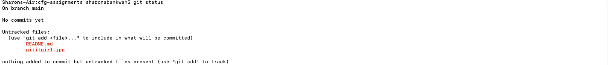
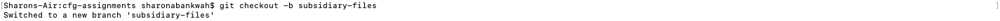
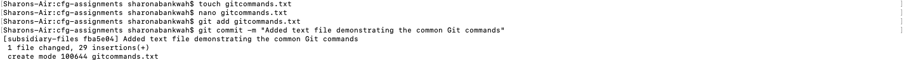
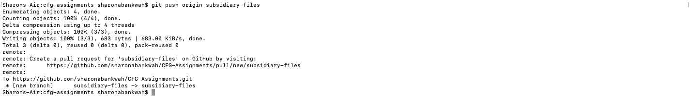
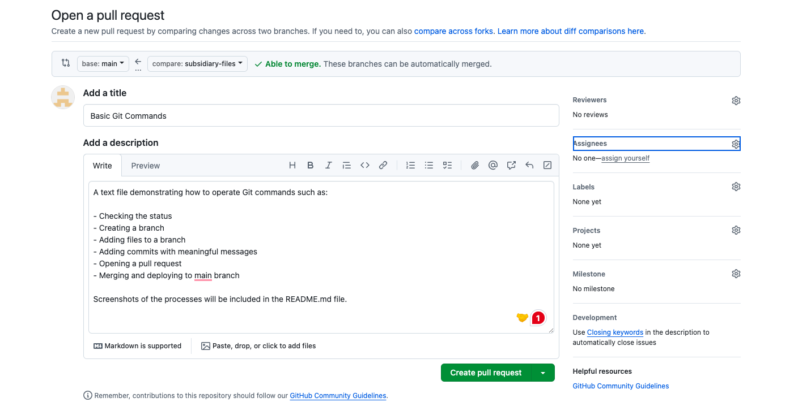
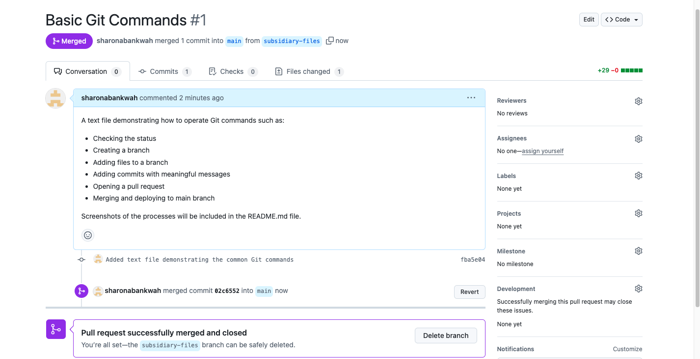

These screenshots correspond with the git commands instructions:

1 - Checking the status

2 - Creating a branch

3 - Adding files to a branch

4 - Adding commits with meaningful messages

5 - Opening a pull request

6 - Merging and deploying to main branch

